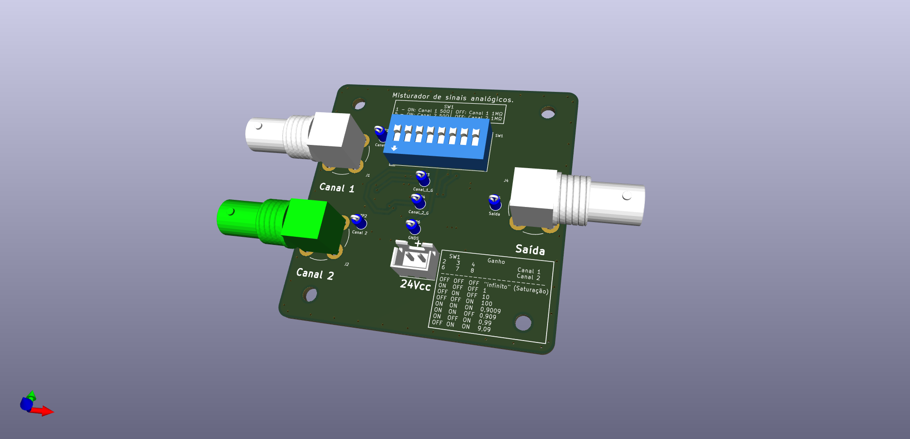
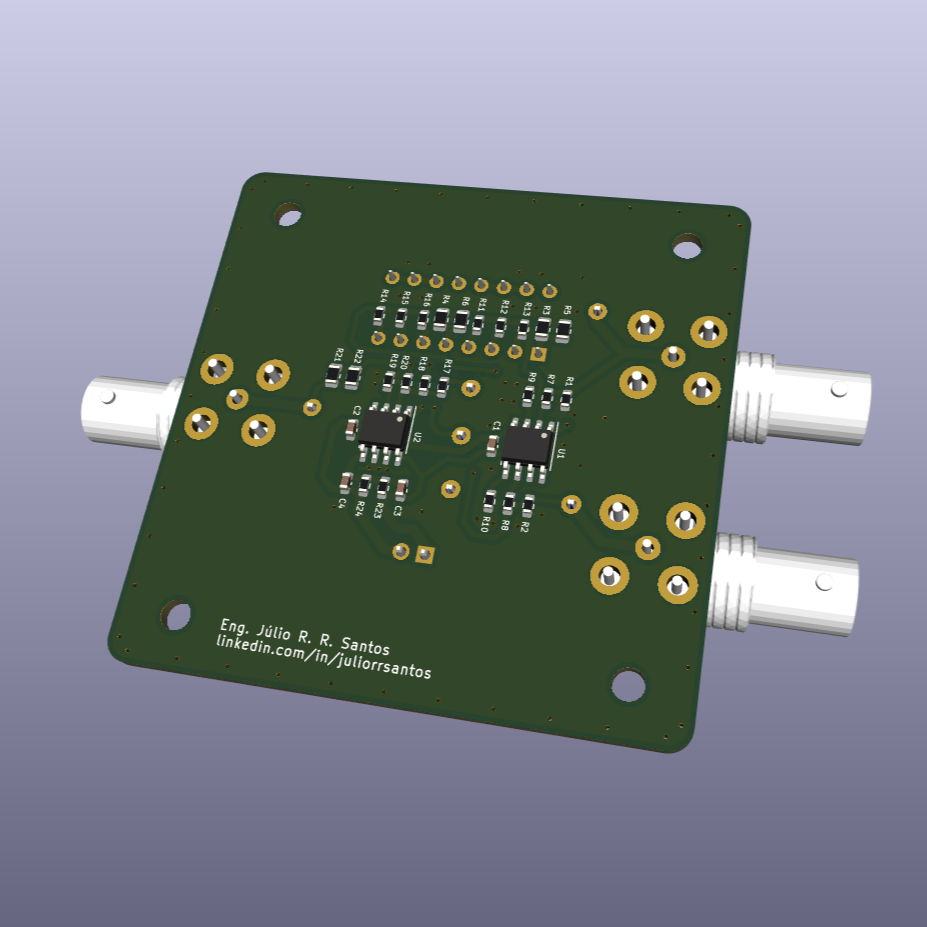

# Misturador de sinais

## Circuito desenvolvido como complemento para estudos de FFT
O diagrama esquemático do circuito pode ser conferido **[aqui](./KiCad/SignalMixer/SignalMixer.pdf).**

Características:
- Duas entradas de sinais analógicos, com opção de alta impedância de entrada ou 50 ohms.
- configuração de ganho por canal de 1x, 10x, 100X e valores intermediarios pela combinação dos resistores.
- Alimentação por fonte simples de 24Vcc.
- A saída será o resultado da soma dos dois sinais de entrada, multiplicado por seus respectivos ganhos.

obs.: A fonte utilizada para alimentação do circuito não deverá ser a mesma que alimenta o gerador de sinais da entrada, ou o circuito conectado à saída.

## Imagens da placa

### Vista frontal

### Vista traseira
